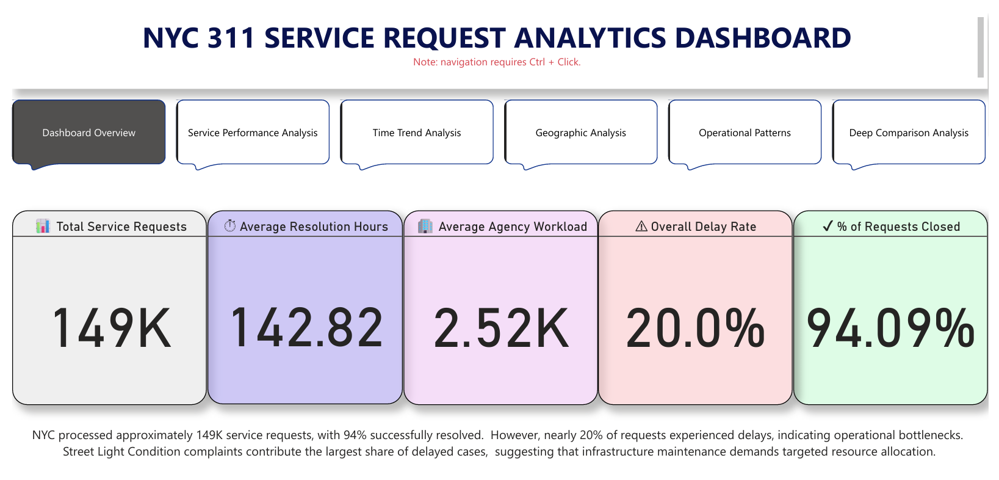

# NYC 311 Service Request Resolution Analytics

**Improving Public Service Resolution Efficiency: An Analytics Study of NYC 311 Service Requests (2025–2026)**

> Capstone Project — DAMO-699-7 | Master of Data Analytics  
> University of Niagara Falls Canada | Winter 2026  
> **Group 5:** Aarmi Patel, Mounika Ravella, Ashajyothi Yarlagadda, Mahvish Kounain

---

## Project Overview

This project analyses approximately **149,000 NYC 311 service request records** (January 2025 – January 2026) to identify factors influencing service resolution efficiency and examine patterns associated with delayed service resolution.

Using descriptive analytics, statistical testing, predictive modelling, and interactive Power BI dashboards, the study provides actionable insights to support more proactive and data-driven municipal service management.

---

## Research Questions

1. How do service request volumes and resolution times vary across boroughs, agencies, and complaint types?
2. Which agencies and complaint types exhibit higher probabilities of delayed service resolution?
3. What temporal factors influence resolution performance?
4. Can delayed service resolution be predicted using historical service request attributes?
5. How does agency workload influence the likelihood of delayed service resolution?

---

## Dataset

- **Source:** [NYC Open Data Portal](https://opendata.cityofnewyork.us/)
- **File:** `311_Service_Requests.csv`
- **Records:** ~149,000 service requests
- **Period:** January 2025 – January 2026
- **Key Fields:** Unique Key, Created Date, Closed Date, Agency, Borough, Complaint Type, Descriptor, Status, Latitude, Longitude

---

## Project Structure

```
311-Service-Requests-Capstone/
│
├── dashboard/
│   └── Capstone Project.pbix           # Interactive Power BI dashboard
│
├── data/
│   ├── cleaned/                        # Cleaned dataset (311_clean_base.csv)
│   ├── meta data/                      # Metadata file describing all variables
│   └── raw/                            # Original raw dataset
│
├── images/
│   ├── Deep Comparsion Analysis.png    # Dashboard screenshot
│   ├── Geographic Analysis.png         # Dashboard screenshot
│   ├── KPI.png                         # Dashboard screenshot
│   ├── Operational Patterns.png        # Dashboard screenshot
│   ├── Service Performance analysis.png
│   └── Time trend Analysis.png         # Dashboard screenshot
│
├── notebooks/
│   ├── 311_Service_Requests_Project.ipynb   # Full analysis notebook
│   └── 311_Service_Requests_Project.html    # HTML export of notebook
│
├── reports/                            # Project report and presentation
│
├── README.md
├── requirements.txt
└── .gitignore
```

---

## Methodology

### Data Cleaning (Python)
- Removed irrelevant and sparse columns
- Handled missing values using domain-based rules
- Converted date fields to datetime format
- Calculated `resolution_hours` and `resolution_days`
- Created binary `is_closed` and `is_delayed` flags

### Feature Engineering
| Feature | Description |
|---|---|
| `resolution_hours` | Time to close a service request (hours) |
| `resolution_days` | Time to close a service request (days) |
| `is_delayed` | Binary flag — top 20% longest resolutions = delayed |
| `elapsed_hours_so_far` | Duration of open/unresolved requests |
| `agency_workload_daily` | Number of active requests per agency per day |
| `is_weekend` | Weekend indicator |
| `season` | Seasonal category |

### Statistical Methods
| Method | Purpose |
|---|---|
| Kruskal–Wallis Test | Compare resolution times across boroughs |
| Dunn Post-hoc Test | Identify which borough pairs differ |
| Chi-Square Test | Association between agency/complaint type and delay |
| Logistic Regression | Predict delay probability |
| Decision Tree | Capture nonlinear relationships |
| Random Forest | Improve predictive performance |

### Database Design
- **SQLite** star schema: `fact_requests` + `dim_agency`, `dim_borough`, `dim_problem_type`, `dim_time`
- Integrated with **Power BI** for interactive dashboards

---

## Key Findings

- **Resolution times differ significantly across boroughs** — Staten Island has the longest median resolution time; Manhattan the shortest (H-statistic = 5070.54, p < 0.001)
- **Street Light Condition complaints** have the highest delay rate (56.77%), far above Water System (10.35%) and Sewer (5.92%)
- **DOT** experiences substantially higher delay rates than DEP
- **Monthly delay rate peaks in December** at 42.99%
- **Higher agency workload increases delay probability** — a 100-unit increase in workload raises the odds of delay by ~4.3%
- **Predictive models achieved ROC-AUC > 0.85**, confirming historical attributes can predict delays

### Model Performance Summary

| Model | AUC |
|---|---|
| Logistic Regression | 0.85 |
| Decision Tree | 0.86 |
| Random Forest | > 0.85 |

---

## Power BI Dashboards

The interactive dashboard contains 6 report pages:

| Dashboard | Preview |
|---|---|
| KPI Overview |  |
| Service Performance Analysis |  |
| Time Trend Analysis |  |
| Geographic Analysis |  |
| Operational Patterns |  |
| Deep Comparison Analysis |  |

---

## How to Run

### 1. Clone the repository
```bash
git clone https://github.com/Aarmi-collab/311-Service-Requests-Capstone.git
cd 311-Service-Requests-Capstone
```

### 2. Install dependencies
```bash
pip install -r requirements.txt
```

### 3. Open the notebook
```bash
jupyter notebook notebooks/311_Service_Requests_Project.ipynb
```

### 4. Open the dashboard
Open `dashboard/Capstone Project.pbix` in **Power BI Desktop**

---

## Requirements

See `requirements.txt` for the full list of Python dependencies.

---

## References

- Batty, M. (2013). *The new science of cities.* MIT Press.
- Chen, H., Chiang, R. H., & Storey, V. C. (2012). Business intelligence and analytics. *MIS Quarterly, 36*(4), 1165–1188.
- James, G., Witten, D., Hastie, T., & Tibshirani, R. (2021). *An introduction to statistical learning* (2nd ed.). Springer.
- New York City Open Data. (2025). NYC 311 service requests dataset. https://opendata.cityofnewyork.us/

---

## License

This project was completed for academic purposes at the University of Niagara Falls Canada.  
© 2026 Group 5 — Master of Data Analytics
